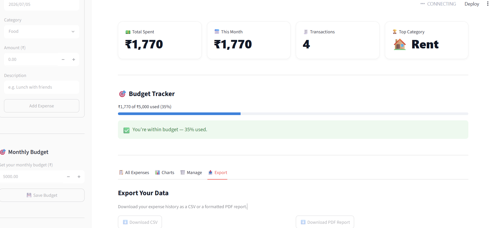

# 💰 Personal Expense Tracker

A full-featured personal finance dashboard built with **Streamlit**, **SQLite**, and **Plotly** — track expenses, set budgets, visualize spending, and export reports, all from a clean, interactive web app.

### 🔗 [Live Demo](https://expenses-tracker-bwhneutfv5brcvtyptkz5h.streamlit.app)



## ✨ Features

- **➕ Manual Expense Entry** — Log transactions with date, category, amount, and description
- **🗣️ Natural Language Entry** — Add expenses by typing things like *"spent 250 on lunch yesterday"* — a rule-based NLP parser automatically extracts the amount, category, and date
- **🎯 Budget Alerts** — Set a monthly budget and get real-time progress tracking with color-coded warnings as you approach or exceed your limit
- **📊 Interactive Charts** — Visualize spending by category (pie chart) and over time (line chart) using Plotly
- **📋 Transaction Management** — View all expenses in a searchable table, delete entries by ID
- **📤 Export Reports** — Download your expense history as a **CSV** file or a formatted **PDF report**
- **🎨 Clean Dark-Friendly UI** — Custom-styled interface with metric cards, badges, and a polished layout

## 🛠️ Tech Stack

| Layer | Technology |
|---|---|
| Frontend / App Framework | [Streamlit](https://streamlit.io/) |
| Database | SQLite |
| Data Visualization | [Plotly](https://plotly.com/python/) |
| PDF Generation | [fpdf2](https://pypi.org/project/fpdf2/) |
| Data Handling | Pandas |
| Language | Python 3 |

## 📸 Screenshots

### Dashboard with Budget Tracker & Export Tab


## 🚀 Getting Started

### Prerequisites
- Python 3.9+
- pip

### Installation

1. **Clone the repository**
   ```bash
   git clone https://github.com/divyayata1623/expenses-tracker.git
   cd expenses-tracker
   ```

2. **(Optional) Create a virtual environment**
   ```bash
   python -m venv venv
   venv\Scripts\activate      # Windows
   source venv/bin/activate   # macOS/Linux
   ```

3. **Install dependencies**
   ```bash
   pip install streamlit pandas plotly fpdf2
   ```

4. **Run the app**
   ```bash
   streamlit run app.py
   ```

5. Open your browser to `http://localhost:8501` (it should open automatically).

## 📁 Project Structure

```
expenses-tracker/
├── app.py                  # Main Streamlit application
├── database.py             # SQLite database logic (init, add, fetch, delete)
├── generate_sample_data.py # Script to populate sample expenses for testing
├── data/
│   └── budget.json         # Stores the user's monthly budget setting
├── screenshots/
│   └── dashboard.png
└── README.md
```

## 🗺️ How It Works

1. **Add an expense** — either manually via the sidebar form, or by typing a plain-English sentence into the Quick Add box.
2. **Set a monthly budget** — the app calculates what percentage you've used and flags overspending.
3. **Explore your data** — switch between tabs to view all transactions, see charts broken down by category and time, manage/delete entries, or export your data.
4. **Export** — download a CSV for spreadsheets or a polished PDF summary report for record-keeping.

## 🔮 Future Improvements

- Replace rule-based NLP parsing with an LLM-powered parser (Anthropic API) for more flexible natural language entry
- Multi-user support with authentication
- Recurring expense tracking
- Custom date-range filtering for charts and exports

## 👩‍💻 Author

Built by [Divya](https://github.com/divyayata1623) as a portfolio project to demonstrate full-stack Python development, data visualization, and practical UI/UX design.

## 📄 License

This project is open source and available under the [MIT License](LICENSE).
